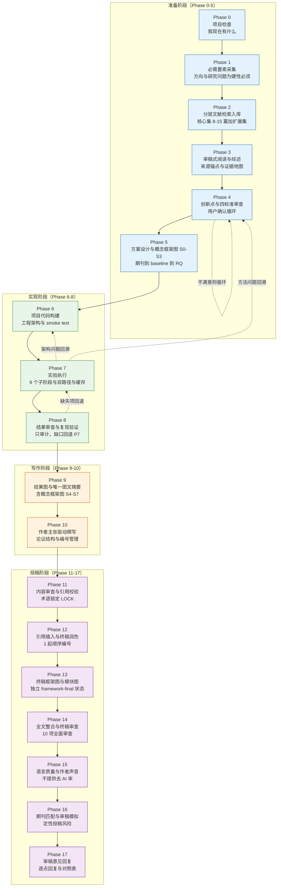
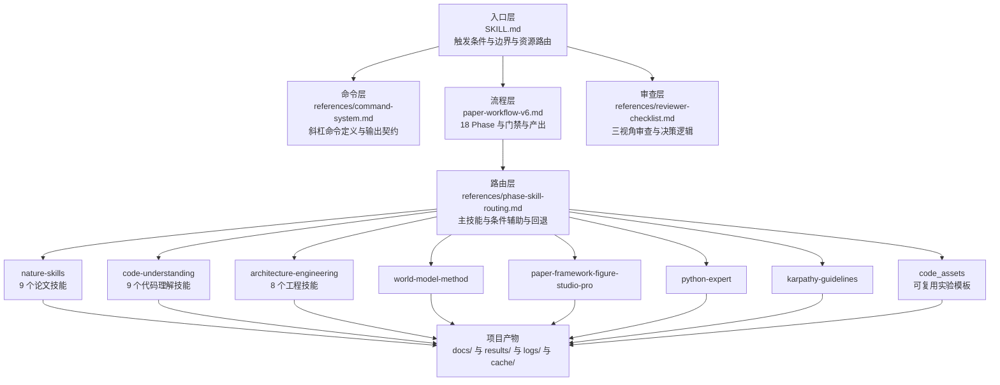
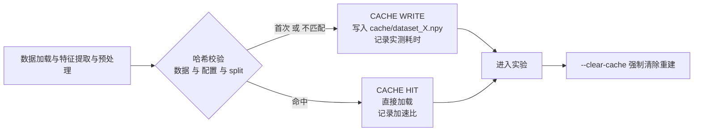
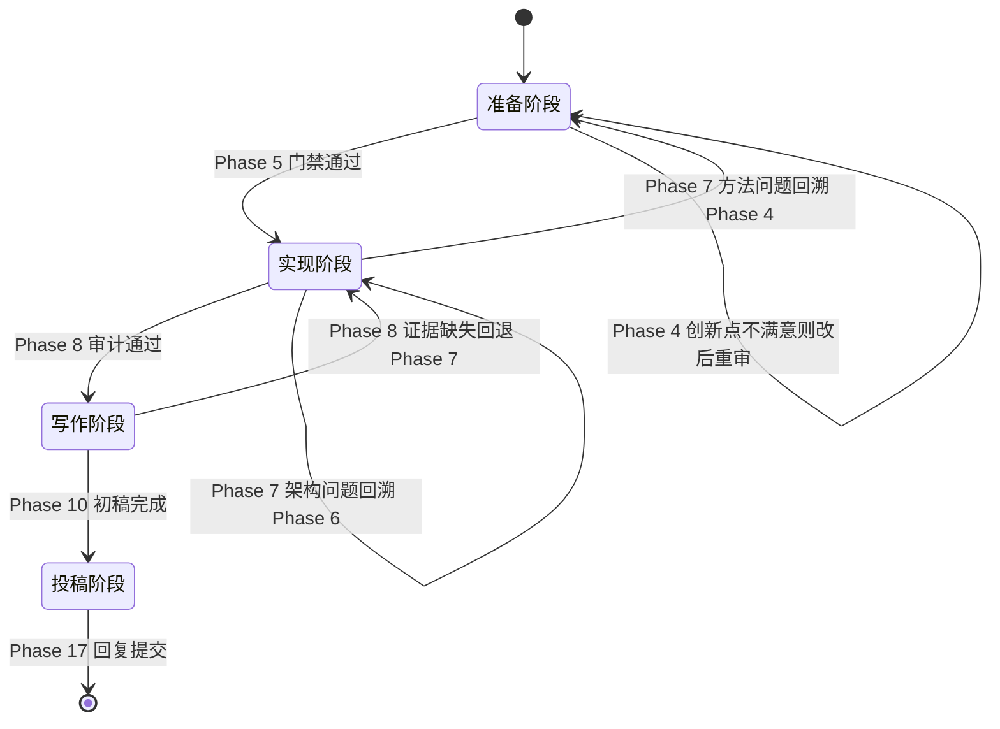
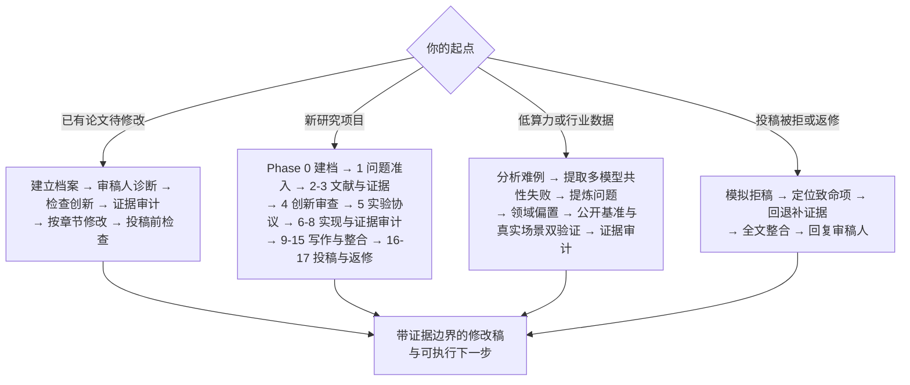

# Paper-gogo v6.0

> **审稿人倒推、证据优先**的学术论文研究与修改工作流。以真实本地技能为执行单元，覆盖从零起点立项到审稿意见回复的 18 个 Phase。

- **仓库**：<https://github.com/gqallen931/paper-gogo>（Public）
- **入口**：根目录 `SKILL.md`
- **当前工作流**：`paper-workflow-v6.md`（18 Phase）｜历史基线：`paper-workflow-v5.md`
- **适用范围**：CV / NLP / LLM / KG / Medical AI / PHM / Time Series / RL / Speech / Tabular ML
- **框架无关**：PyTorch / TensorFlow / JAX / NumPy 均可
- **内置技能**：**57 个**（工作流技能组 30 个 + 附加合集 27 个），完整清单见 [SKILLS_INDEX.md](SKILLS_INDEX.md)
- **包规模**：约 4300 个文件，57 MB（其中 2156 个 SVG 矢量图资产约 30 MB）

## 目录

1. [这是什么](#1-这是什么)
2. [框架](#2-框架)
3. [技术](#3-技术)
4. [流程](#4-流程)
5. [使用方法](#5-使用方法)
6. [许可证](#6-许可证)
7. [目录结构](#7-目录结构)

---

## 1. 这是什么

Paper-gogo 不是一个"上传论文→自动重写全文"的流水线，而是一套**对话式**工作流：AI 是合作者，不是 checklist 执行器。它的核心立场是**从审稿人视角倒推**——研究问题、创新点、实验设计和写作都必须能回答五个问题：重要性、创新性、证据充分性、边界条件、期刊匹配度。

v6 在 v5 的 18 Phase 骨架上叠加了一层**执行升级**（v6 增强层），但不废止原有实验、写作、投稿与返修流程。它解决的核心问题是：**如何防止用文字掩盖实验缺口**。

### 三条设计原则

| 原则 | 含义 |
|---|---|
| **证据优先** | 每条实质主张必须带四态证据标签；证据缺失时停止结论并标记 `MISSING`，而不是用润色越过去 |
| **审稿人倒推** | 每个 Phase 的产出都要经得起三视角审稿（创新性 / 方法学与可复现性 / 论证与期刊匹配） |
| **禁止伪优化** | 不以规避 AI 检测器为目标，不生成伪精确录用概率，不把包装当作科学贡献 |

---

## 2. 框架

### 2.1 四阶段十八 Phase

工作流由 4 个阶段、18 个 Phase 组成，**Phase 之间松耦合**：用户可以跳转、回溯、跳过，但涉及学术真实性、数据完整性、证据充分性和投稿合规性的**质量门禁不得跳过**；跳转前必须记录前置门禁状态与未解决风险。



### 2.2 质量门禁 G0-G6

7 道门禁构成"审稿人倒推"的可判定形式。**门禁结果为 `PASS`、`PASS WITH CONDITIONS` 或 `FAIL`**；失败门禁必须给出修复路径，**不能靠润色覆盖**。

| 门禁 | 审稿人问题 | 必须产出 | 中文目标 |
|---|---|---|---|
| **G0** Scope | 是否在期刊范围内且合乎伦理可审？ | 项目档案与目标期刊匹配度 | 期刊范围、材料和伦理准入 |
| **G1** Problem | 问题是否重要且非平凡？ | "现象—机制—条件"三层问题表述 | 研究问题重要且可回答 |
| **G2** Novelty | 创新是否领域驱动且有文献支撑？ | 主张地图与创新性判定 | 创新由领域机制和文献支持 |
| **G3** Design | 研究设计能否检验核心主张？ | 主张—实验矩阵 | 研究设计能检验核心主张 |
| **G4** Evidence | 结果是否支撑每一条主要主张？ | 证据审计与失败分析 | 实验证据支撑结论 |
| **G5** Manuscript | 论证是否自洽且可复现？ | 审稿人审计与修订台账 | 全文论证一致且可复现 |
| **G6** Submission | 期刊匹配、文件、引用与披露是否就绪？ | 投稿检查清单 | 投稿文件、引用和披露完整 |

### 2.3 证据状态与执行标记

四态证据标签是整个框架的**共同语言**，用于标记每一条实质主张：

| 标签 | 含义 | 允许的措辞强度 |
|---|---|---|
| `SUPPORTED` | 由已提供的证据支持 | 可作确定性陈述 |
| `INFERRED` | 合理解释，但需显式标注 | 必须写明为推断 |
| `VERIFY` | 需作者或来源核实 | 不得当作已确认事实 |
| `MISSING` | 所需证据缺失 | **必须停止相应结论** |

框架还定义了一组执行标记，用于防止"假装跑过"：

| 标记 | 触发条件 | 后果 |
|---|---|---|
| `NON_EVALUABLE` | Stub、模拟数据、未完成运行 | 不得进入主表、排名、统计检验或论文主张 |
| `SKILL_UNAVAILABLE` | 主技能不可用 | 执行**有边界的人工回退**，不得假装技能已运行 |
| `AUTHOR_INPUT_NEEDED` | 输入不足 | 生成占位字段，**不得猜测** |
| `LOCK` | 术语锁定项 | 润色前锁死；Phase 14 要求 23 项 LOCK 术语—公式—代码三方对齐 |

### 2.4 指令优先级

发生冲突时**必须执行高优先级规则**：

```
SKILL.md 真实性边界与安全规则
  > paper-workflow-v6.md 增强规则与质量门禁
    > references/phase-skill-routing.md 执行路由
      > 各 Phase 继承自 v5 的流程描述
```

**绝不允许用一条遗留的 v5 句子绕过真实性、证据、伦理或期刊政策核验。**

---

## 3. 技术

### 3.1 架构分层



### 3.2 技能库

技能分为 **7 个技能群**，按职责分工，全部为本地目录（不是 ZIP，也不需要联网安装）：

| 技能群 | 目录 | 技能数 | 用途 |
|---|---|---|---|
| 论文 | `nature-skills/` | 9 | 检索、阅读、写作、润色、引用、数据、图表、PPT、审稿回复 |
| 代码理解 | `code-understanding/` | 9 | 条件式代码理解、差异分析、故障诊断 |
| 工程 | `architecture-engineering/` | 8 | 领域建模、模块设计、TDD |
| 决策 | `world-model-method/` | 1 | 复杂方案比较、决策与审查 |
| 框架图 | `paper-framework-figure-studio-pro/` | 1 | 严格逐回合 S0-S7 论文框架图 |
| 编码护栏 | `karpathy-guidelines/` | 1 | 简洁、可验证、最小范围的代码修改 |
| Python | `python-expert/` | 1 | 模型、训练、评估与实验实现 |

**`nature-skills/`（9 个）**：`nature-academic-search`（多源检索与引用核验）、`nature-reader`（全文精读，保留页码段落图表锚点）、`nature-writing`（结构重建与逐节撰写）、`nature-polishing`（语言精修，不改技术含义）、`nature-citation`（引用分级与格式导出）、`nature-data`（数据可用性与仓库标识符）、`nature-figure`（出版级图表，须先选定 Python 或 R）、`nature-paper2ppt`（生成真实 PPTX 而非大纲）、`nature-response`（逐点回复包）。

**`code-understanding/`（9 个）**：`understand`（代码知识图谱）、`understand-chat`、`understand-dashboard`、`understand-diff`、`understand-domain`、`understand-explain`、`understand-knowledge`、`understand-onboard`、`diagnosing-bugs`。

**`architecture-engineering/`（8 个）**：`codebase-design`、`domain-modeling`、`tdd`、`improve-codebase-architecture`、`resolving-merge-conflicts`、`grilling`、`grill-me`、`grill-with-docs`。

> `understand` 系技能为**条件调用**：需要外部 plugin root、agents、Node.js 与 pnpm。预检不通过时回退为范围受限的直接代码检查，而不是中断流程。

### 3.3 技能调用协议

每次执行 Phase 或命令都走同一条固定链路，**不自动串联相邻 Phase**：


主技能与辅助技能的区别是**条件性**：每个 Phase 只有一个主技能，辅助技能仅在触发条件命中时加载，**默认不加载全部列出技能**。

### 3.4 写作与润色总门禁

写作相关 Phase 的路由由"草稿当前状态"决定，而不是由用户想做什么决定：

| 草稿状态 | 执行技能 | 处理方式 |
|---|---|---|
| 核心主张、证据或边界缺失 | `nature-writing` | 只生成结构与占位符，先暴露科学缺口 |
| 章节结构或段落任务混乱 | `nature-writing` | 重构论证架构 |
| 逻辑完整但语言粗糙 | `nature-polishing` | 精修语言，不改变技术含义 |
| 论断需要文献支撑 | `nature-citation` | 分段、检索、核验支撑等级 |
| 需要回到来源论文 | `nature-reader` | 保留页码、段落与图表锚点 |
| 需要回复真实审稿意见 | `nature-response` | 生成可追踪逐点回复包 |

**关键约束**：逻辑未通过时**禁止只做表面语言美化**。润色升级顺序固定为：论文类型 → 章节任务 → 段落逻辑 → 主张/证据/边界 → 句子语言。

### 3.5 数据缓存与状态同步

Phase 7 的缓存机制以**数据/配置/split 哈希**为失效判据，并在命中时报告实测加速比：



缓存目录固定为 `cache/`（`.npy`、`dataset_meta.json`、`split_train/val/test.json`）。**失效规则**：SHA 不匹配或 `--clear-cache` → 清除重建。

工作流的状态同步遵循固定的文件契约：

| 文件 | 更新内容 |
|---|---|
| `docs/README.md` | Phase 完成度与状态 |
| `docs/项目工作阶段记录/Phase{N}_{name}.md` | 每个 Phase 结束**强制**写入的完整产出记录 |
| `results/phase7_progress.json` | Phase 7 实时进度 |
| `results/phase7_{sub}.json` | Phase 7 结构化结果 |
| `logs/{sub}_errors.log` | Phase 7 错误日志 |

### 3.6 运行时依赖

| 组件 | 依赖 | 说明 |
|---|---|---|
| 工作流本体 | 无 | 纯 Markdown，复制目录即可用 |
| `code_assets/` 模板 | Python 3 | 66 个 Python 文件；配置驱动，无需额外包即可跑通结构 |
| `nature-academic-search` MCP server | `mcp>=1.0.0`、`requests>=2.28.0`、`toml>=0.10.2`、`lxml>=4.9.0` | 可选，用于多源文献检索 |
| 框架图工作流 | 图片生成路由（ChatGPT web / Codex `$imagegen`） | 运行时路径必须保持 project-run-relative |
| `understand` 系技能 | 外部 plugin root + Node.js + pnpm | 可选，预检不通过则回退 |

> **中文编码契约**：设计初衷原文与所有中文固定提示词必须按 UTF-8 原文输出。Windows PowerShell 下不要从未指定编码的 `Get-Content` / `Select-String` 输出复制原文；使用 `Get-Content -Encoding UTF8`、`rg` 或其他 UTF-8 安全读取方式。若看到 `璁捐`、`棰濆`、`锛`、`鈥` 或中文里的 `?`，说明输出已乱码，**必须重新读取，不得把乱码写入回复、产物、state 或 prompt**。

### 3.7 目录与产物约束

产物必须落在约定目录内，**禁止散落**：

| 目录 | 内容 |
|---|---|
| `docs/` | 论文材料、阶段记录、参考文献、综述、创新点、图表、投稿包 |
| `results/` | 结构化实验结果、表格、审查报告 |
| `logs/` | 运行日志与错误日志 |
| `cache/` | 可再生缓存 |
| `.understand-anything/` | 代码理解状态（仅 `understand` 实际成功运行时生成） |

---

## 4. 流程

### 4.1 Phase 速览

| Phase | 阶段 | 名称 | 核心产出 | 主技能 |
|---:|---|---|---|---|
| 0 | 准备 | 项目检查 | 项目模型、材料清单、目标与约束 | `world-model-method` |
| 1 | 准备 | 必需要素采集 | 术语表、"现象—机制—条件"问题、边界决策 | `domain-modeling` |
| 2 | 准备 | 分层文献检索入库 | 检索日志、分层去重文献库、已核验元数据 | `nature-academic-search` |
| 3 | 准备 | 审稿式全文阅读与综述 | 来源锚点、证据地图、综述草稿 | `nature-reader` |
| 4 | 准备 | 创新点识别与审查 | 创新分类、领域偏置地图、候选路径比较 | `world-model-method` |
| 5 | 准备 | 方案设计与概念框架图 S0-S3 | `RQ.md`、`baseline_清单.md`、`实验协议.md`、概念图方向 | `world-model-method` |
| 6 | 实现 | 项目代码构建 | 实现计划、可测模块、可复现配置、smoke test PASS | `codebase-design` |
| 7 | 实现 | 实验执行 | 可执行实验、`phase7_full.json`、`results/tables/*.tex` | `python-expert` |
| 8 | 实现 | 结果审查与复现验证 | 主张—证据矩阵、泄漏与公平性报告、复现 checklist | `world-model-method` |
| 9 | 写作 | 可视化与图文摘要 | 出版级图表、每图 figure brief、最多 1 份 Graphical Abstract | `nature-figure` |
| 10 | 写作 | 作者主张驱动撰写 | 完整初稿、主张—证据表、编号注册表 | `nature-writing` |
| 11 | 投稿 | 内容审查与引用校验 | 审稿报告、术语表 LOCK、风险清单 | `nature-writing` |
| 12 | 投稿 | 引用插入与终稿润色 | 引用可信的修订稿、`refs.bib` 按 [1] 起排序 | `nature-polishing` |
| 13 | 投稿 | 终稿框架图与模块图 | `fig_framework_final.*`、模块图、联合语义审计 | `paper-framework-figure-studio-pro` |
| 14 | 投稿 | 全文整合与终稿审查 | 一致性审查通过、`submission_package/` | `world-model-method` |
| 15 | 投稿 | 语言质量与作者声音 | 语言终稿、`语言质量报告.md` | `nature-polishing` |
| 16 | 投稿 | 期刊匹配与审稿模拟 | 期刊匹配报告、模拟审稿意见、定性投稿风险 | `world-model-method` |
| 17 | 投稿 | 审稿意见回复 | `response_to_reviewers.md`、修改对照表、REVISED 稿 | `nature-response` |

> 上表主技能以 `references/phase-skill-routing.md` 为准（该文件是权威执行路由）。`paper-workflow-v6.md` 的 Phase 详细设计段落存在个别技能列不一致与 Phase 命名漂移，遇到冲突时以路由文件与 `SKILL.md` 为准。

### 4.2 关键 Phase 细节

**Phase 2 — 分层文献库**：核心集通常 **8–15 篇**（偏离须记录理由），加可扩展集。数量由领域成熟度与论文类型决定，**不以固定篇数替代覆盖度**。所有"首次/领先/尚未解决"表述必须进入 `VERIFY` 清单。PDF→Markdown 为硬性要求：双栏/单栏兼容、全文文字、图表完整、参考文献逐条保留。

**Phase 4 — 四标准审查**：模块堆砌检测（A+B+C 拼凑还是本质新机制？→ 直接退回）、真实创新性（与现有工作本质区别？→ 退回）、目标期刊贡献门槛（对标已核验的期刊范围与同类论文贡献幅度 → 退回或降级主张）、实验可实现性（算力/数据/复杂度是否合理？→ 退回）。**通用注意力、残差连接、位置编码或模型替换不得单独计为交叉创新。**

**Phase 7 — 9 个子阶段与优先级**：7A 实验设置（P0）、7B 主实验结果（P0）、7C 消融与机制验证（P0，存在可分解设计或机制主张时）、7D 超参敏感度（P1）、7E 鲁棒性（主张含鲁棒性时 P0，否则 P1）、7F 泛化 ★（主张含泛化时 P0，否则 P1）、7G 效率（P1）、7H 定性分析（P1）、7I 汇总出表（P0）。7F 细分为跨数据集、跨场景、少样本迁移（10%/25%/50% finetune）、跨时间/跨传感器。

**Phase 8 — 只审计**：本阶段不产出新实验，只做审计。结果完整性检查 FAIL 时**自动生成回退清单**并映射到 Phase 7 子阶段；代码扫描含 8 项标准 checklist（死代码、数据泄漏、配置一致性、硬编码路径、种子固定、训练测试分离、标签泄漏、数据增强一致性）；公平性审查逐项附具体建议。每个 WARN/FAIL 由用户三选一：**接受 / 回退修复 / 标注理由跳过**。

**Phase 13 — 独立框架图状态**：必须新建独立的 `framework-final` 状态并**从最终定稿重新执行 S0**，**不得复用或静默覆盖** Phase 5/9 的 `framework-concept` 状态。S7 只有在图、caption、legend 与正文引用句**联合审查通过**后才算完成。

**Phase 14 — 10 项全面审查**：图表最终整合、全文完整性、图表正确性、参考文献正确性、参考文献顺序（[1]→[N] 首次出现顺序，同篇复用同号）、数据—正文一致性（每个定量数字对照 Phase 7 JSON）、术语—公式—代码一致性（23 项 LOCK 三方对齐）、排版格式、投稿包生成、最终审查报告。

**Phase 16 — 定性风险而非概率**：8 维 editorial 视角审查；3 位不同类型审稿人（方法专家、应用专家、理论专家）；输出**高/中/低**桌拒风险与 Reject/Major/Minor/Accept 模拟判断，**不生成伪精确录用概率**。用户决策四选一：**[A] 修高优投 / [B] 全修投 / [C] 不修投 / [D] 换期刊**。

**Phase 17 — 回复黄金法则**：① 永远先感谢审稿人；② 优先解决问题，必要时用数据、文献或范围边界礼貌商榷；③ 每条回复三要素 = 感谢 + 说明修改（具体+位置）+ 证据；④ 修改处蓝色高亮并标注行号；⑤ 不要只说"已修改"不说改了什么、不遗漏任何一条、不带防御性语气。**不得声称未完成的实验或修改已经完成。**

### 4.3 回溯机制



### 4.4 规则优先级与不可跳过项

| 不可跳过 | 出处 |
|---|---|
| 涉及学术真实性、数据完整性、证据充分性、投稿合规性的质量门禁 | 全局规则 1 |
| Phase 1 研究问题必须完成"现象—机制—条件"三层表达；用户说不清时 AI 帮理清思路 | Phase 1 门禁 |
| Phase 6 stub 必须标记 `NON_EVALUABLE`，不得进入实验与排名 | Phase 6 / Phase 7 真实性门禁 |
| Phase 12 逻辑未通过时禁止只做表面语言美化 | Phase 12 门禁 |
| Phase 17 不得声称未完成的实验或修改已完成 | Phase 17 强制输出 |

---

## 5. 使用方法

### 5.1 安装

将整个 `Paper-gogo-v2` 目录复制到你所用工具的 skills 目录，并**确保入口文件仍为根目录 `SKILL.md`**。

```powershell
# 克隆
git clone https://github.com/gqallen931/paper-gogo.git
```

**外部 ZIP 压缩包不视为已安装技能**：只有解压后存在可读取的 `SKILL.md`，工作流才可以调用它。这一点适用于本包，也适用于任何外部技能。

### 5.2 启动

```text
/paper-gogo
```

**未指定命令时，默认只执行 `/建立档案` 并停止**，不会自动重写整篇论文。

### 5.3 命令清单

#### 建档与诊断

| 命令 | 作用 |
|---|---|
| `/建立档案` | 提取领域、目标期刊、研究问题、方法、数据、实验、结论、贡献与主要风险。**不重写论文** |
| `/审稿人诊断` | 模拟三视角（A 创新性 / B 方法与可复现性 / C 论证与期刊匹配），输出作者意见、编辑保密意见与建议决定 |
| `/评分` | 应用 100 分制量表，解释扣分项并列出 5 项最高价值修复。**不换算为录用概率** |
| `/目标期刊` | 评估范围、文章类型、贡献门槛、证据深度与呈现要求；未提供现行指南时标 `VERIFY` |

#### 问题与创新

| 命令 | 作用 |
|---|---|
| `/提炼问题` | 用"现象 → 机制 → 条件"产出一个主问题与两个备选 |
| `/检查创新` | 分类贡献（领域创新 / 方法工程改进 / 通用技术应用 / 仅呈现）；标记 "first" "novel" "SOTA" "robust" 等无支撑措辞 |
| `/领域偏置` | 识别领域结构、物理、因果关系、时序周期、拓扑与操作规则，映射到归纳偏置与判别实验 |

#### 证据与实验

| 命令 | 作用 |
|---|---|
| `/修改实验` | 审计数据划分、泄漏、baseline、公平性、超参、可复现性、重复运行、不确定性、鲁棒性、效率、泛化与失败分析 |
| `/设计消融` | 为每个核心主张指定消融、控制变量、预期观察与结果对主张的影响 |
| `/分析难例` | 建立领域适配的错误分类，检测多模型共性失败，推荐场景/设备/批次/时间划分以防泄漏 |
| `/证据审计` | 生成主张—位置—支撑图表—证据状态—替代解释—缺失测试—允许措辞表 |
| `/检查公式` | 检查定义、量纲、索引、编号、符号一致性、假设与推导完整性 |

#### 章节修改

| 命令 | 作用 |
|---|---|
| `/修改标题` | 提供 5 个有边界标题并推荐 1 个 |
| `/修改摘要` | 背景/问题 → 未解难点 → 方法与领域依据 → 定量结果 → 有边界贡献 |
| `/修改引言` | 谜题或现实矛盾 → 重要性 → 现有解释 → 未解冲突 → 新视角 → 贡献 |
| `/修改相关工作` | 按对话组织文献：主流解释 → 局限 → 替代观点 → 冲突/互补 → 本文位置 |
| `/修改方法` | 每个模块说明问题、理由、领域依据、实现、模块关系、预期效果与验证实验 |
| `/修改结果` | 观察结果 → 与假设关系 → 支撑解释 → 适用条件 → 异常与失败 |
| `/修改讨论` | 机制、与既有工作关系、启示、范围、失败条件、替代解释与无支撑外推 |
| `/修改局限` | 具体局限、对当前结论的影响、可行验证路径 |
| `/修改结论` | 只总结有支撑的发现，不引入新结果、不夸大影响 |
| `/逐段修改` | 返回原问题、替换段落、关键改动与缺失的作者信息 |
| `/学术润色` | 提升准确性、简洁性、连贯性与学科语域，**不改变技术含义、不规避检测器** |
| `/压缩`、`/中译英`、`/英译中` | 保留术语、数字、公式、引用与逻辑强度 |

#### 审稿与投稿

| 命令 | 作用 |
|---|---|
| `/模拟拒稿` | 列出最多 10 条可能拒稿理由，分为致命/主要/次要，标明哪些可润色修复、哪些需补证据 |
| `/投稿前检查` | 检查标题、摘要、Highlights、图文摘要、贡献、方法、结果、图表、补充材料、引用、声明与结论的一致性 |
| `/回复审稿人` | 每条意见按"感谢 → 理解 → 行动 → 证据 → 精确位置"回复 |

#### 产物与执行

| 命令 | 作用 |
|---|---|
| `/生成汇报PPT` | 调用 `nature-paper2ppt` 生成**真实 PPTX**，而非仅大纲 |
| `/补充引用` | 调用 `nature-citation` 分段主张、保守分级、核验元数据并导出 |
| `/数据可用性` | 调用 `nature-data` 盘点数据集、选择获取路径、起草声明 |
| `/生成结果图` | 调用 `nature-figure`；未指定 Python 或 R 时**先问并停止** |
| `/生成图文摘要` | 目标期刊要求或允许时生成**最多 1 份**图文摘要 |
| `/生成框架图` | 调用框架图工作流，**只执行明确请求的那一个 S 步骤**，绝不自动推进 |
| `/代码实现` | 调用 `codebase-design`，按需叠加 `tdd` / `python-expert` / `karpathy-guidelines` |
| `/诊断实验错误` | 调用 `diagnosing-bugs`；**先构建可变红的反馈循环**，再形成根因假设 |

### 5.4 修改类命令的统一输出契约

所有修改类命令固定返回五段，缺一不可：

1. **诊断** — 问题与严重程度
2. **修改稿** — 请求范围内的完整替换文本
3. **修改依据** — 每处主要改动修复了什么
4. **证据边界** — `SUPPORTED` / `INFERRED` / `VERIFY` / `MISSING`
5. **下一步** — 不超过 5 条按优先级排序的行动

未被明确授权时，必须保留引用标识、公式、变量、数值与术语。无法核验的引用标 `VERIFY`，**绝不猜测其内容**。

### 5.5 典型路线



**三类问题的分流**决定了走哪条路：**表达问题**可直接改；**论证问题**需重构；**证据问题**必须补分析、实验或来源——**禁止用润色掩盖**。

### 5.6 使用边界

工作流明确拒绝以下行为：

- 不虚构实验、数据、引用、创新性、作者贡献或已完成的修改
- 不把相关性写成因果，不把结论扩展到证据之外
- 不承诺录用，不给出伪精确的录用概率
- 不以规避 AI 检测器为优化目标（只提升清晰度、具体性与作者声音）
- 不把"换一个通用模型"当作跨领域创新
- 用户只请求某个范围内的命令时，不重写整篇论文

---

## 6. 许可证

> **重要提示：本包当前没有仓库级 `LICENSE` 文件。** 未附许可证的公开仓库在法律上默认"保留所有权利"，这**不等于**允许自由再分发或商用。完整证据记录见 [THIRD_PARTY_NOTICES.md](THIRD_PARTY_NOTICES.md)。

### 6.1 内置第三方技能

| 组件 | 许可证 | 依据 |
|---|---|---|
| `world-model-method/` | ✅ **MIT** | `world-model-method/LICENSE` 全文，Copyright (c) 2026 王多鱼AI (Wang Duoyu) |
| `karpathy-guidelines/` | ✅ **MIT** | `karpathy-guidelines/SKILL.md` frontmatter 声明 `license: MIT` |
| `nature-skills/`（9 个） | ⚠️ **未核实** | 无 LICENSE 文件、无 `license:` 声明、无上游署名 |
| `code-understanding/`（9 个） | ⚠️ **未核实** | 同上 |
| `architecture-engineering/`（8 个） | ⚠️ **未核实** | 同上 |
| `python-expert/` | ⚠️ **未核实** | 同上 |
| `paper-framework-figure-studio-pro/` | ⚠️ **未核实** | 同上 |

### 6.2 附加技能合集（`extra-skills/`）

这四个合集是对工作流的补强，**许可证与上面的技能组不同**：

| 合集 | 许可证 | 技能数 |
|---|---|---|
| `extra-skills/academic-research-skills/` | ⚠️ **CC BY-NC 4.0（禁止商业使用）** | 4 |
| `extra-skills/claude-scholar/` | ✅ **MIT** | 19 |
| `extra-skills/paper-craft-skills/` | ✅ **MIT**（上游 README 声明） | 3 |
| `extra-skills/scipilot-figure-skill/` | ✅ **MIT** | 1 |

> `academic-research-skills` 是本仓库中**唯一带非商业限制**的部分：允许署名再分发，但**不得用于商业用途**。若需商用，请删除该目录。详见 [extra-skills/THIRD_PARTY_NOTICES.extras.md](extra-skills/THIRD_PARTY_NOTICES.extras.md)。

### 6.3 原创组件

`SKILL.md`、`paper-workflow-v6.md`、`paper-workflow-v5.md`、`README.md`、`references/`、`code_assets/` 为本包原创。**它们同样没有附许可证**，因此默认保留所有权利。

### 6.4 第三方引用与商标

内置文档会讨论第三方研究、工具与期刊政策。其中的**观点、论文标题、期刊政策与引用元数据仅作学术引用**，权利归各自作者所有。本仓库**未复制**任何第三方文章、视频或数据集。

`paper-framework-figure-studio-pro` 的设计初衷原文中提及个人姓名，属该技能固定输出文本的一部分。

### 6.5 待办

若要让本仓库可被安全地再分发（例如允许他人 fork 与商用），需要：

1. 确认 5 个"未核实"组件的上游来源与许可证
2. 将上游许可证文本放入 `LICENSES/`，或在各组件 `SKILL.md` frontmatter 补 `license:` 字段
3. 为原创部分添加仓库级 `LICENSE`（如 MIT / CC BY 4.0）
4. 更新 [THIRD_PARTY_NOTICES.md](THIRD_PARTY_NOTICES.md) 与 [PUBLIC_REPO_SETUP.md](PUBLIC_REPO_SETUP.md)

---

## 7. 目录结构

```text
Paper-gogo-v2/
├── SKILL.md                              # 入口：触发条件、边界、G0-G6、100 分量表、输出契约
├── README.md                             # 本文件
├── paper-workflow-v6.md                  # 当前 18 Phase 工作流（中文正文，ASCII 文件名）
├── paper-workflow-v5.md                  # 历史基线版本
├── PACKAGE_MANIFEST.md                   # 包清单与工作流完整性哈希
├── V2_RELEASE_NOTES.md                   # v2 发布说明
├── PUBLIC_REPO_SETUP.md                  # 公开发布配置与发布前检查清单
├── THIRD_PARTY_NOTICES.md                # 第三方许可证证据
├── SKILLS_INDEX.md                       # 内置技能清单（自动生成，共 57 个）
├── references/
│   ├── command-system.md                 # 命令定义与输出规则
│   ├── reviewer-checklist.md             # 三视角审查与决策逻辑
│   └── phase-skill-routing.md            # 权威执行路由（主技能/辅助/门禁/回退）
├── nature-skills/                        # 9 个论文技能
├── code-understanding/                   # 9 个代码理解技能
├── architecture-engineering/             # 8 个工程技能
├── world-model-method/                   # 决策与审查（MIT）
├── paper-framework-figure-studio-pro/    # 逐回合 S0-S7 框架图工作流
├── karpathy-guidelines/                  # 编码护栏（MIT）
├── python-expert/                        # Python 实验实现
├── extra-skills/                         # 附加第三方合集（27 个技能，许可证不同）
└── code_assets/                          # 可复用实验与项目模板
```

`code_assets/` 会在 Phase 4/6 被复制到用户项目中，并依据 `docs/project_meta.yaml` 填充项目专属值：

```text
code_assets/
├── utils/          progress.py · flops_stub.py · helpers.py
├── train/          trainer.py
├── experiments/    phase7_full.py
├── eval/           metrics.py
├── baselines/      factory.py
├── configs/        default.yaml
├── scripts/        init_project.py
└── docs/           project_meta.yaml
```

这些模板**与学科无关**：通过运行时读取 `configs/default.yaml` 适配 CV/NLP/LLM/KG/Medical/PHM/TimeSeries/RL/Speech/Tabular。

---

## 版本历史

| 版本 | 日期 | 变更 |
|---|---|---|
| v6.0 | 2026-07-15 | 完整继承 v5 正文；审稿人倒推；命令系统；四态证据；领域偏置；写作润色升级；18 阶段本地技能路由 |
| v5.0 | 2026-06-27 | 18 阶段对话式工作流 |
| v2 包 | 2026-09-28 | 公开仓库发布；修复 v6 可执行性；补齐内置技能；报告术语与结构化润色 |

完整性哈希（见 [PACKAGE_MANIFEST.md](PACKAGE_MANIFEST.md#L5-L10)）：

| 文件 | SHA-256 |
|---|---|
| `paper-workflow-v5.md` | `E0D5462B50D6BFEE115A9D6C67E30F83A84EA31831F097E55DB9DEDC2476AA9D` |
| `paper-workflow-v6.md` | `D82371E10E54663769DBF6866119572379F4FA8FE90CA64C8FFA4B84FEF023FC` |

若需了解工作流全貌，请以 `SKILL.md`（边界与门禁）、`paper-workflow-v6.md`（18 Phase 细节）与 `references/phase-skill-routing.md`（执行路由）三份文件为准。
