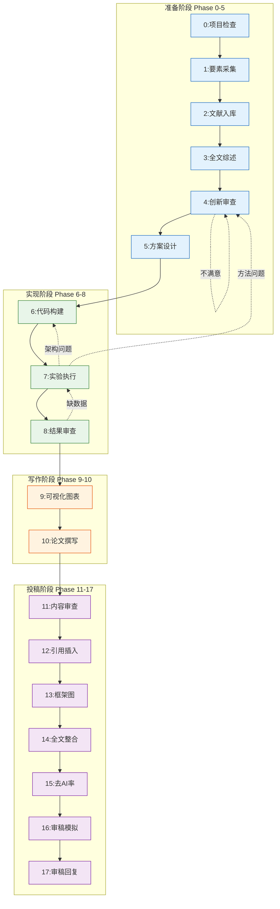

# Paper-gogo v5.0 · 论文工作流技能包

> AI 协作学术论文全流程 · 18 Phase · 对话式 · 10 领域
> Date: 2026-06-27 · Design: v5.0 Final

## 一句话

从 idea 到 accepted paper——覆盖项目启动、文献调研、创新点识别、代码实现、实验执行、论文撰写、投稿审查、审稿回复的完整 AI 协作工作流。

## 工作流 Mermaid 图



## 目录结构

```
Paper-gogo/
├── SKILL.md                                     ← 技能定义 (v5.0)
├── README.md                                    ← 本文件
├── 论文工作流.md                                 ← 主工作流文档 (v5.0)
├── 论文工作流_v5.md                              ← 工作流详细版
├── 工作流问题记录.md                              ← 设计迭代全记录
├── 论文工作流_子步骤分解.md                        ← 子步骤索引
│
├── nature-skills/                               ← L9  Nature 出版工具 9合1
├── code-understanding/                          ← L9  代码理解 9合1
├── architecture-engineering/                    ← L8  架构 & 工程 9合1
├── world-model-method/                          ← 全局统筹
├── karpathy-guidelines/                         ← Karpathy 代码准则
├── paper-framework-figure-studio-pro/            ← 论文框架图 v3.1.4a
├── python-expert/                               ← Python 专家
│
└── code_assets/                                 ← 可复用代码模板
    ├── baselines/factory.py                     ← Baseline 工厂
    ├── configs/default.yaml                     ← 七段分层配置
    ├── eval/metrics.py                          ← 多任务指标
    ├── experiments/phase7_full.py               ← 交互式实验运行器
    ├── train/trainer.py                         ← Phase 7 兼容 Trainer
    ├── utils/progress.py                        ← 统一进度日志
    ├── utils/flops_stub.py                      ← FLOPs 估算
    ├── utils/helpers.py                         ← 通用工具
    ├── scripts/init_project.py                  ← 新项目脚手架
    └── docs/project_meta.yaml                   ← 项目元信息模板
```

## 技能清单

### 内置技能（本技能包包含）

| # | 技能群 | 等级 | 技能数 | 用途 |
|---|--------|------|--------|------|
| 1 | `nature-skills/` | L9 | 9 | 论文写作/调研/绘图/润色/引用/数据/审稿全链路 |
| 2 | `code-understanding/` | L9 | 9 | 代码知识图谱/问答/差异/解释/领域/入门 |
| 3 | `architecture-engineering/` | L8 | 9 | 代码设计/建模/审查/测试/TDD/冲突 |
| 4 | `world-model-method/` | — | 1 | 全局统筹/决策/审查 |
| 5 | `paper-framework-figure-studio-pro/` | — | 1 | 论文总体框架图 S0-S7 |
| 6 | `karpathy-guidelines/` | — | 1 | Karpathy 代码质量准则 |
| 7 | `python-expert/` | — | 1 | Python 专家支持 |

### 外部技能（需单独安装）

| 技能 | D:\Skills 路径 | 用途 |
|------|---------------|------|
| paper-craft-skills | `paper-craft-skills-main.zip` | 论文工艺（摘抄/仿写/术语/AI检测） |
| academic-research-skills | `academic-research-skills-main.zip` | 学术研究（内容审查/期刊匹配/审稿模拟） |
| scipilot-figure-skill | `scipilot-figure-skill-main.zip` | 科学图表辅助 |
| codegraph | `codegraph-main.zip` | 代码结构可视化 |

## 硬性约束总表

| # | 约束项 | 技能群 | 适用 Phase | 违规后果 |
|---|--------|--------|-----------|---------|
| 1 | 全局统筹 | `world-model-method` | 0, 5-17 | 重大决策无审查 |
| 2 | 代码质量 | `架构&工程 L8` | 6, 7, 8 | 代码架构无保障 |
| 3 | 代码理解 | `代码理解 L9` | 0, 2, 6, 8, 13 | 禁止仅靠人工阅读 |
| 4 | 出版工具 | `nature-skills L9` | 2-5, 9-17 | 禁止通用工具替代 |
| 5 | 框架图 | `paper-framework-figure v3.1.4a` | 5(S0-S3), 9(S4-S7), 13 | 禁止 matplotlib/PPT/Visio |
| 6 | 论文工艺 | `paper-craft-skills` | 10-15, 17 | 摘抄/仿写/去AI质量 |
| 7 | 学术规范 | `academic-research-skills` | 4, 11, 14, 16 | 内容审查/期刊匹配 |

## 安装

### Claude Code

```bash
# 方式 1：直接复制
cp -r D:/Skills/Paper-gogo ~/.claude/skills/paper-gogo

# 方式 2：从 GitHub
# (push 后在 Claude Code 对话中)
/install paper-gogo
```

### Codex (OpenAI)

```bash
cp -r D:/Skills/Paper-gogo ~/.codex/skills/paper-gogo
```

### 安装外部依赖

```bash
# 解压外部技能到 Paper-gogo 目录
cd D:/Skills/Paper-gogo
unzip ../paper-craft-skills-main.zip -d paper-craft/
unzip ../academic-research-skills-main.zip -d academic-research/
unzip ../scipilot-figure-skill-main.zip -d scipilot-figure/
```

## 使用

在任意论文项目对话中：

```
/paper-gogo                    ← 启动工作流
start Phase 7                  ← 直接进入实验阶段
帮我做 Phase 11 的内容审查     ← 跳到特定 Phase
我要修改 Phase 4 的创新点      ← 回到之前的 Phase
```

## 新项目脚手架

```bash
python code_assets/scripts/init_project.py --name MyProject --discipline cv --task classification --git
```

## 文档

| 文件 | 内容 |
|------|------|
| `SKILL.md` | 技能定义 + Phase 总览 + 技能矩阵 + 安装 |
| `README.md` | 本文件 |
| `论文工作流_v5.md` | 完整 18 Phase 详细设计 + Mermaid + 控制台规范 + 缓存机制 |
| `工作流问题记录.md` | 设计迭代全程（~38 条问题→设计→方案） |
| `code_assets/README.md` | 代码模板说明 |

## 版本历史

| 版本 | 日期 | 变更 |
|------|------|------|
| v5.0 | 2026-06-27 | 18 Phase 对话式重构；新增 Phase 13-17；去AI率；审稿模拟；审稿回复；Mermaid图；控制台规范；缓存机制 |
| v4.0 | 2026-06-27 | Phase 0-16 重新编号；4 阶段结构 |
| v3.2 | 2026-06-24 | 子步骤分解 + 令牌烧毁方案 + 10 领域知识库 |
